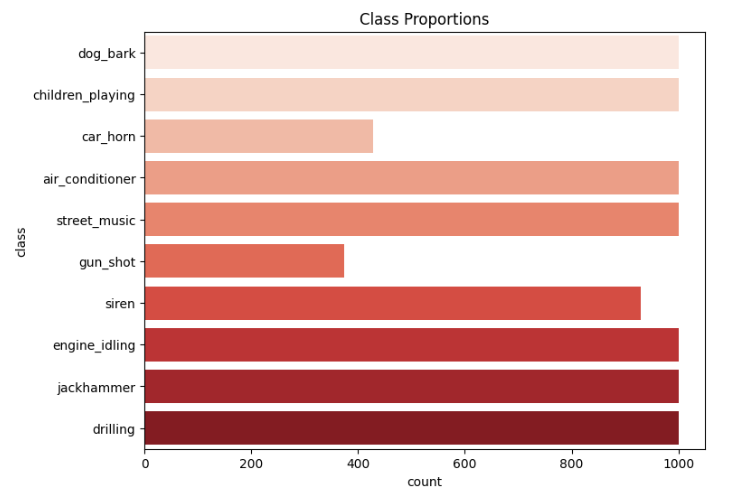

# Urban-Sound-CLassification

## Project Overview
This project demonstrates a deep learning solution for classifying urban sounds using the UrbanSound8K dataset. The goal is to build and train a neural network that can accurately categorize different types of sounds, such as car horns, dog barks, and drilling, based on audio data.

## Dataset Description
The UrbanSound8K dataset contains 8732 labeled sound excerpts (<=4s) of urban sounds from 10 classes:


<h3>Sound Class Distribution</h3>

<p>Below is a plot showing the distribution of samples for each sound class:</p>

<p align="center">
  
</p>


Each audio file is provided as a WAV file with different sample rates and durations. The dataset is organized into 10 folds, allowing for cross-validation.

## Downloading the Dataset

Since the dataset is not provided directly in this repository, you can download it from the following source :

[UrbanSound8K on Kaggle](https://www.kaggle.com/datasets/chrisfilo/urbansound8k).

### After downloading the dataset:
**1.Extract the Dataset:**    
  
Once the ZIP file is downloaded, extract it into your working directory.  
For example, if you're running the notebook on Kaggle, the dataset will be automatically available in the following directory:  
```sh
/kaggle/input/urbansound8k/  
```
This is the path used throughout the notebook.  
  
**2.Path Configuration:**    
  
If you are working locally or in another environment (like Google Colab), ensure that the extracted files are accessible in the specified directory. You might need to adjust the file paths in the notebook if your setup differs. In the provided notebook, in the provided notebook, different data paths are used for various files:  
- For the CSV file containing metadata:  
```sh
/kaggle/input/urbansound8k/UrbanSound8K.csv
```
- For audio files within specific folds:  
```sh
/kaggle/input/urbansound8k/fold1/101415-3-0-2.wav  
```
Make sure this path is correct for your environment, or change the path configuration in the notebook as needed.
## Installation and Requirements
To run the notebook on your local machine, you will need to install the following dependencies:  
- Python 3.7+  
- Jupyter Notebook  
- TensorFlow or PyTorch (depending on your implementation)  
- Librosa (for audio processing)  
- NumPy  
- Pandas  
- Matplotlib  
- Scikit-learn
  
You can install the required packages using the following commands:  
```sh
pip install -r requirements.txt
```  
Alternatively, you can create a virtual environment and install the dependencies:  
```sh 
python -m venv env
source env/bin/activate  # On Windows, use env\Scripts\activate   
pip install -r requirements.txt  
``` 

## Model File

The trained model is saved in the `Models` folder. You can use this model for inference or further fine-tuning. The model file is named `Sound_classification_model.h5` (or whatever the actual name is). To load the model, use the following code snippet:

```python
from tensorflow.keras.models import load_model

model = load_model('Model/Sound_classification_model.h5')
```

## Usage 

**1.Data Preprocessing:** The notebook includes steps for loading and preprocessing the audio data. This involves converting the audio files into MFCCs, which are suitable for input into a deep learning model. 
  
**2.Model Training:** The notebook demonstrates how to define, train, and evaluate a neural network using TensorFlow/Keras.  
  
**3.Model Evaluation:** The performance of the model is evaluated using metrics such as accuracy, precision, recall, and F1-score. The notebook also includes visualizations of the results.  
  
**4.Inference:** You can use the trained model to classify new audio files by running the inference section of the notebook.

## Authors

Rayane Mehires - rayanemehires@gmail.com

Project Link: [GitHub - Urban Sound Classification](https://github.com/MRayane/Urban-Sound-Classification/tree/main).

## Thank you
  
